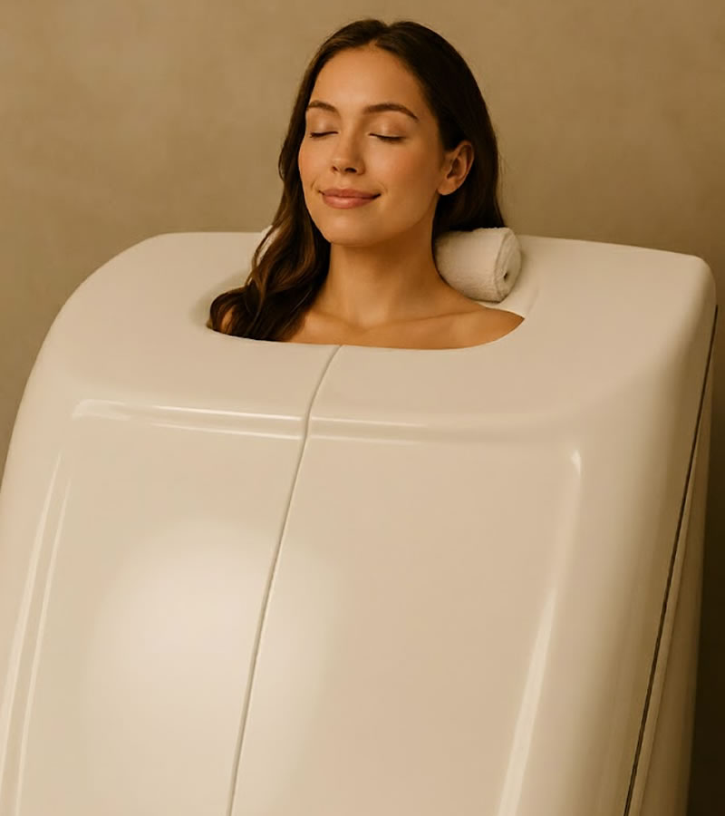

# SERVICE CARD IMAGE POSITIONING GUIDE

## Problem Fixed
Images were cropping heads off because they were centered (`object-position: center`).

## ✅ Current Solution Applied

```css
object-position: center top;
```

This shows the **TOP** of the image, keeping heads visible.

---

## Object Position Options

If you need to adjust individual images differently, here are all the options:

### Basic Positions

```css
object-position: center top;      /* Top center (heads visible) ✓ APPLIED */
object-position: center center;   /* Dead center (default) */
object-position: center bottom;   /* Bottom center (feet visible) */
object-position: left center;     /* Left side */
object-position: right center;    /* Right side */
```

### Fine-Tuned Positions

```css
object-position: center 20%;      /* 20% from top (show heads + shoulders) */
object-position: center 30%;      /* 30% from top (more body) */
object-position: 60% center;      /* 60% from left (shift right) */
```

---

## For Specific Service Cards

If you need different positioning for different services, add these classes:

### Option 1: Add to HTML

```html
<!-- For HOCATT image that needs more adjustment -->
<div class="service-compact-image image-position-top">
    
</div>
```

Then in CSS:

```css
.image-position-top img {
    object-position: center top;
}

.image-position-upper img {
    object-position: center 20%; /* Show upper portion */
}

.image-position-shift-left img {
    object-position: 40% center; /* Shift image left */
}
```

---

## Quick Fixes for Common Issues

### Issue: Head still cut off at top
```css
object-position: center 10%; /* Show very top of image */
```

### Issue: Too much head, want to see more body
```css
object-position: center 25%; /* Show from 25% down */
```

### Issue: Person is on left/right side of photo
```css
object-position: 30% top;     /* Person on left */
object-position: 70% top;     /* Person on right */
```

### Issue: Person is sitting down (need to see face + lap)
```css
object-position: center 35%; /* Show upper-middle portion */
```

---

## Testing Image Position

To test different positions quickly, add this to your browser console:

```javascript
// Target all service images
document.querySelectorAll('.service-compact-image img').forEach(img => {
    img.style.objectPosition = 'center 25%'; // Try different values
});
```

Or add inline style temporarily to HTML:

```html

```

---

## Image Crop Visualization

```
┌───────────────────────┐
│   Head (keep this!)   │ ← top (0%)
├───────────────────────┤
│   Shoulders           │ ← 20%
├───────────────────────┤
│   Torso               │ ← center (50%)
├───────────────────────┤
│   Legs                │ ← 80%
├───────────────────────┤
│   Feet                │ ← bottom (100%)
└───────────────────────┘

Current setting: center top (shows from 0% down)
```

---

## Specific Recommendations by Service

Based on typical images for each service:

**HOCATT (person in chamber):**
```css
object-position: center 25%; /* Show head + upper chamber */
```

**Red Light (person standing in front of panel):**
```css
object-position: center 15%; /* Show head + shoulders + panel */
```

**Cryotherapy (person in chamber):**
```css
object-position: center top; /* Show head above chamber */
```

**IV Therapy (person sitting/reclining):**
```css
object-position: center 30%; /* Show face + arm with IV */
```

**Hyperbaric (person inside chamber):**
```css
object-position: center 20%; /* Show upper body in chamber */
```

---

## Current CSS Applied

```css
/* Compact service cards */
.service-compact-image img {
    object-position: center top;
}

/* Detailed service cards */
.service-image img {
    object-position: center top;
}
```

This keeps ALL service images showing the top (heads visible).

---

## If You Need Individual Control

Add specific classes for each service in your HTML:

```html
<div class="service-compact-image hocatt-image">
    
</div>
```

Then in CSS:

```css
.hocatt-image img {
    object-position: center 25%;
}

.red-light-image img {
    object-position: center 15%;
}

.cryo-image img {
    object-position: center top;
}
```

This gives you precise control over each service card's image positioning!
